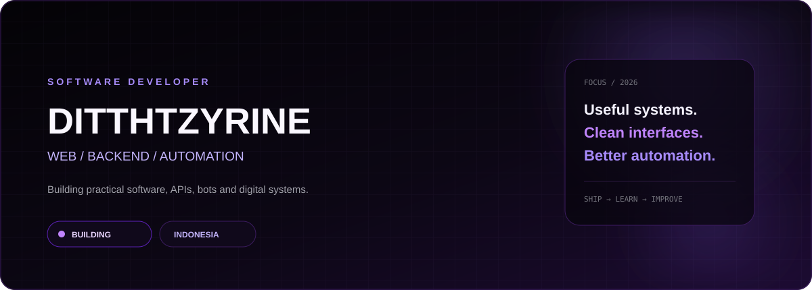
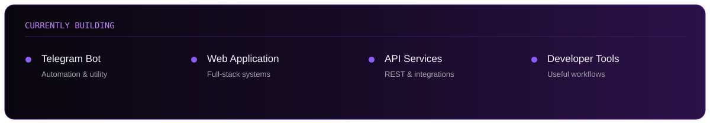
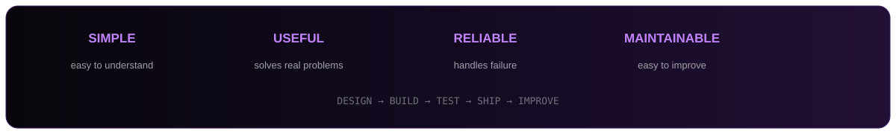
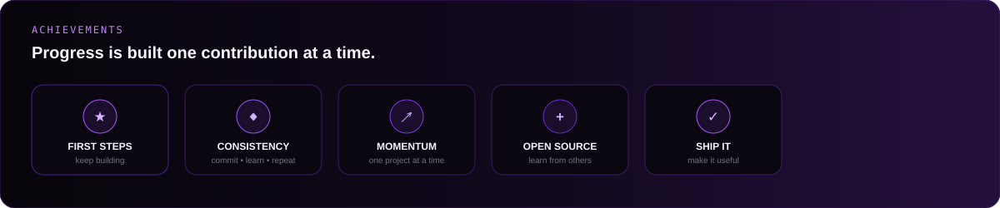
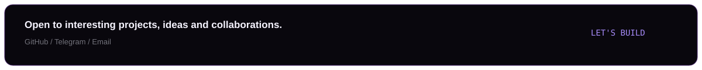

 

 

&nbsp;

&nbsp;

 

> **I build software that starts simple, solves something real, and gets better with every iteration.**

---

## `01` — ABOUT

<table>
<tr>
<td width="60%" valign="top">

### Ditthtzyrine

A developer focused on **web applications, backend systems, APIs, Telegram automation and practical tooling**.

I like the part of development where an idea stops being an idea and becomes something people can actually use. That usually means writing the backend, connecting the APIs, shaping the interface, deploying it, then coming back to improve the rough edges.

**Current direction:** build more useful systems, write cleaner code, understand infrastructure better, and keep experimenting with new ways to automate repetitive work.

</td>
<td width="40%" valign="top">

### Focus

`WEB`

`BACKEND`

`AUTOMATION`

`APIs`

`TELEGRAM`

`DEVOPS`

### Location

`INDONESIA`

</td>
</tr>
</table>

---

## `02` — DEVELOPER SNAPSHOT

| AREA | I BUILD | APPROACH |
|:---|:---|:---|
| **WEB** | Websites, dashboards, internal tools | Responsive · clean · practical |
| **BACKEND** | APIs, services, application logic | Modular · reliable · maintainable |
| **AUTOMATION** | Bots, scripts, workflows | Fast · useful · repeatable |
| **TELEGRAM** | Bots, utilities, moderation systems | Event-driven · API-first |
| **DEVOPS** | Deployment, Linux, containers | Simple · observable · reproducible |
| **UI / UX** | Interfaces and interaction flows | Minimal · intentional · usable |

---

## `03` — TECH STACK

### Languages

  

### Frameworks & Runtime

  

### Data & Services

  

### Tools & Infrastructure

---

## `04` — WHAT I BUILD

<table>
<tr>
<td width="33%" valign="top">

### WEB SYSTEMS

Landing pages, dashboards, admin panels, authentication flows and full-stack applications.

`FRONTEND`
`BACKEND`
`AUTH`
`DASHBOARDS`
`SAAS`

</td>
<td width="33%" valign="top">

### AUTOMATION

Telegram bots, scripts, notifications, scheduled jobs and workflows that remove repetitive work.

`BOTS`
`WORKERS`
`WEBHOOKS`
`SCHEDULERS`
`INTEGRATIONS`

</td>
<td width="33%" valign="top">

### API & INFRA

REST services, third-party integrations, databases, Linux servers and deployment pipelines.

`REST`
`DATABASES`
`LINUX`
`DOCKER`
`DEPLOYMENT`

</td>
</tr>
</table>

---

## `05` — CURRENTLY BUILDING

  

---

## `06` — DEVELOPMENT FOCUS

<table>
<tr>
<td align="center" width="25%"><strong>01</strong>  <b>WEB</b> Interfaces & full-stack products</td>
<td align="center" width="25%"><strong>02</strong>  <b>AUTOMATION</b> Bots, scripts & workflows</td>
<td align="center" width="25%"><strong>03</strong>  <b>BACKEND</b> APIs, data & application logic</td>
<td align="center" width="25%"><strong>04</strong>  <b>INFRA</b> Linux, Docker & deployment</td>
</tr>
</table>

---

## `07` — ENGINEERING PRINCIPLES

 

<table>
<tr>
<td width="50%" valign="top">

**01 · Clarity over cleverness**  
Readable code wins when the project gets bigger.

**02 · Build for real usage**  
A feature matters when it actually helps someone.

**03 · Automate repetition**  
If a task keeps happening, it probably deserves a script.

</td>
<td width="50%" valign="top">

**04 · Design for failure**  
Errors and edge cases are part of the system.

**05 · Ship, then refine**  
A useful first version creates better feedback.

**06 · Keep learning**  
Every project should leave the next one better.

</td>
</tr>
</table>

---

## `08` — GITHUB STATISTICS

  

---

## `09` — ACTIVITY

---

## `10` — CONTRIBUTION CALENDAR

<picture>
  <source media="(prefers-color-scheme: dark)" srcset="./assets/github-contribution-grid-snake-dark.svg" />
  <source media="(prefers-color-scheme: light)" srcset="./assets/github-contribution-grid-snake.svg" />
  
</picture>

---

## `11` — GITHUB ACHIEVEMENTS

---

## `12` — GITHUB METRICS

---

## `13` — OPEN SOURCE

I enjoy reading other people's code, finding patterns worth keeping, and turning useful discoveries into something practical.

  

`DISCOVER` &nbsp;→&nbsp; `UNDERSTAND` &nbsp;→&nbsp; `EXPERIMENT` &nbsp;→&nbsp; `BUILD` &nbsp;→&nbsp; `SHARE`

---

## `14` — TOOLBOX

---

## `15` — NEXT

<table>
<tr>
<td width="50%" valign="top">

### NOW

- Build more reusable developer tools
- Improve existing automation
- Go deeper into backend architecture
- Make deployment workflows cleaner

</td>
<td width="50%" valign="top">

### LATER

- Ship useful developer products
- Contribute more to open source
- Build reliable automation systems
- Keep exploring new technology

</td>
</tr>
</table>

---

## `16` — CONTACT

  

&nbsp;

 

